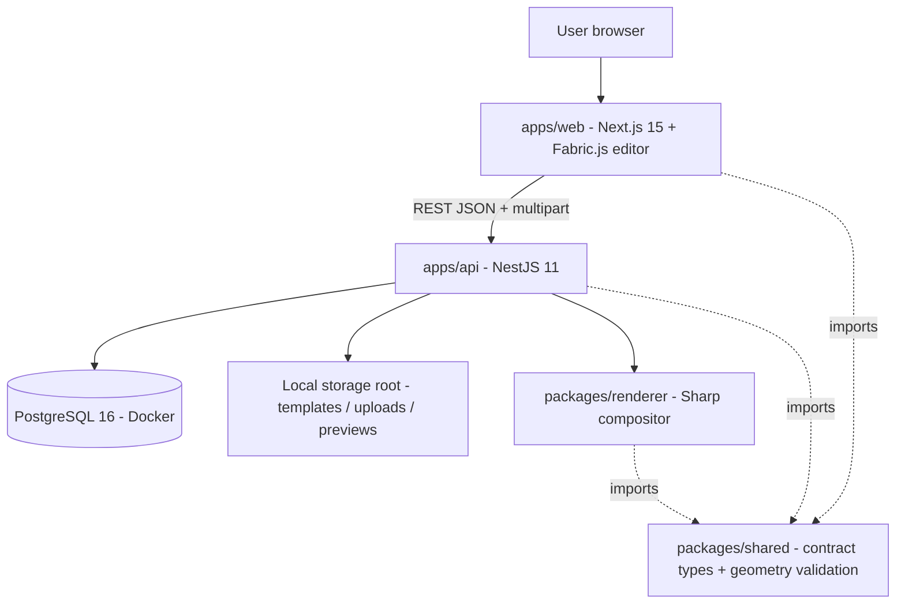
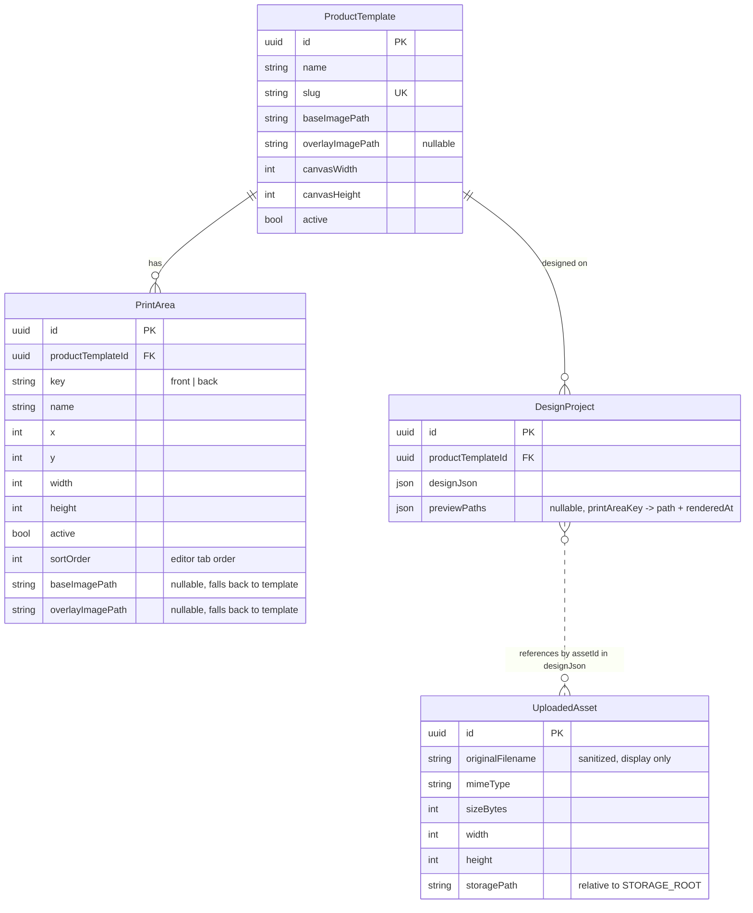

# Architecture

FoloPrint Design Studio is a standalone system. It shares no code, database, or runtime with the
existing FoloPrint Laravel platform.

## System overview



## Workspaces

| Workspace | Responsibility |
|---|---|
| `apps/web` | Editor UI. Loads template + print area, hosts Fabric.js canvas, clamps objects to the print area (UX only), posts design JSON, displays rendered mockups |
| `apps/api` | The authority. Validates uploads (real bytes), validates design geometry, persists everything, streams files, triggers renders |
| `packages/shared` | One source of truth for the design contract: `DesignDocument`, `DesignObject`, API response types, and pure rotated-bounding-box validation used by both sides |
| `packages/renderer` | `renderMockup()` - composes base image + resized/rotated design objects + optional overlay into a PNG buffer with sharp. No framework dependency, unit-testable in isolation |

## Data model



`UploadedAsset` is intentionally not foreign-keyed from `DesignProject`; the design JSON references
assets by id and the API resolves + verifies them at save and render time. Keeps the design
document portable.

## Design document contract

Current version (v2, since v1.2): one document covers every print area the user placed
artwork on. A placement exists only if it has at least one object.

```jsonc
{
  "version": 2,
  "templateId": "uuid",
  "placements": [
    {
      "printAreaKey": "front",
      "objects": [
        {
          "assetId": "uuid",
          "x": 500,        // object CENTER, template canvas px
          "y": 470,
          "width": 180,    // scaled width before rotation
          "height": 120,
          "rotation": 15   // degrees, clockwise
        }
      ]
    },
    { "printAreaKey": "back", "objects": [ /* ... */ ] }
  ]
}
```

Legacy v1 documents (`{ version: 1, printAreaKey, objects }`) still exist in the database.
They are normalized to v2 at every read (`normalizeDesignDocument` in `packages/shared`) and
upgraded in place on the next save. No SQL data migration touches `designJson`.

Validation rules (client for UX, server as authority):
- at least one placement; no duplicate, unknown, or inactive `printAreaKey`
- every placement has at least one object
- all four corners of each rotated object rectangle must lie inside that placement's own
  print area rectangle (0.5px epsilon for float noise)

## Render pipeline

1. Load design + template + print areas, resolve asset storage paths (server-side only).
2. Normalize the document to v2 and re-run full placement validation. Never render
   unvalidated coordinates.
3. For EACH placement, `renderMockup()` with that area's view images (the area's own
   `baseImagePath`/`overlayImagePath`, falling back to the template-level images):
   - base image resized to `canvasWidth x canvasHeight`
   - each object: resize asset to `width x height` -> rotate around center with transparent
     background -> composite at `(x, y)` center
   - optional overlay composited last (shadows/fabric texture sit above the artwork)
4. One PNG per area written to `previews/<designId>/<printAreaKey>.png`; the
   `previewPaths` JSON map (path + renderedAt per area) is stored on the design. Previews
   of areas no longer in the document are deleted. Streaming endpoint:
   `GET /designs/:id/preview/:printAreaKey`.

## Security posture (MVP)

- Upload validation by real byte inspection (`sharp.metadata()`), not extension or client MIME.
  PNG + JPEG only; SVG explicitly rejected. Size limit at multer level, dimension + pixel-bomb
  limits at sharp level. Files re-encoded on save (strips EXIF/metadata, neutralizes appended payloads).
- Filenames sanitized; disk names are always `<uuid>.<ext>`. Original name stored for display only.
- No filesystem paths in API responses. All files stream through ID-based endpoints; the
  `StorageService` rejects any resolved path that escapes `STORAGE_ROOT`.
- Design coordinates re-validated server-side before save AND before render.
- `@nestjs/throttler` rate limits, stricter on upload and render.
- No auth in MVP by explicit scope decision; every endpoint is anonymous.

## Storage abstraction

`StorageService` exposes `save / read stream / exists / resolve` over `STORAGE_ROOT` with relative
keys (`uploads/<uuid>.png`, `previews/<designId>/<areaKey>.png`, `templates/<file>.png`). An S3/R2 driver later
means swapping this one class (signed URLs replace streaming endpoints); DB rows already store
relative keys, so no migration needed.

## Branching and CI merge gate

- `staging` is the default QA branch and is protected by CI: every pull request into
  `staging` runs the full test matrix (`.github/workflows/ci.yml`) and must pass the
  required status check **`ci / verify`** before merge.
- The workflow runs the same checks as local development: `build:packages`,
  `test:shared`, `test:renderer`, `test:api` (against a Postgres 16 service, migrated
  with `prisma migrate deploy` + seeded), and `test:web` (Playwright, Chromium).
- `feature/*` branches are cut from `staging` and merge back via PR only.
- `main` does not exist yet on purpose: it is reserved for the first stable release and
  will be created from `staging` when that release is cut. Do not create or push it.

## Future FoloPrint integration options (decision deferred)

| Option | Shape | Pros | Cons |
|---|---|---|---|
| A. Iframe/embed | FoloPrint embeds the editor page, postMessage handshake, API stays standalone | Zero Laravel changes, fastest | Two sessions/origins to reconcile; UX seams |
| B. API-first service | FoloPrint Laravel calls this API server-to-server (templates synced, designs created via API on behalf of FoloPrint orders) | Clean service boundary, this system stays the single design authority | Needs service auth, id mapping between catalogs |
| C. Frontend adoption | FoloPrint frontend imports `packages/shared` + the editor as a React package; Laravel gets new design endpoints | One UX | Couples release cycles; Laravel must mirror validation |

Recommendation when the time comes: **B**, with template catalog sync and a service token. The
editor already treats the API as its only authority, so pointing FoloPrint at the same API is the
smallest conceptual change. Renderer stays reusable for order-time print-file generation
(higher-DPI export is a renderer parameter, not a rewrite).
